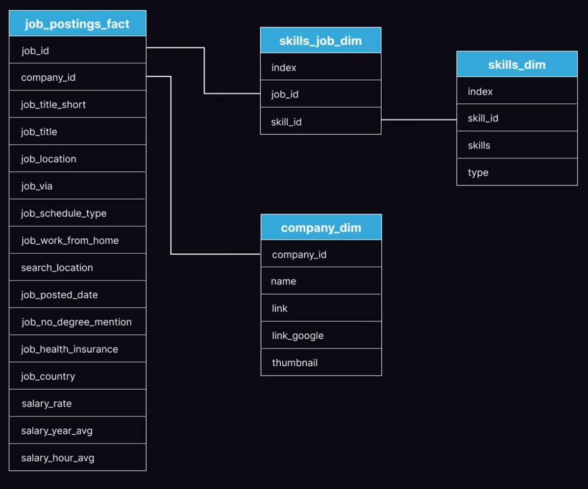

# Data Job Market Analysis — SQL Portfolio Project

## Table of Contents
- [Overview](#overview)
- [Database Schema](#database-schema)
- [Tools Used](#tools-used)
- [SQL Queries and Results](#sql-queries-and-results)
- [How to Run the Project](#how-to-run-the-project)
- [Key Findings](#key-findings)
- [Connect With Me](#connect-with-me)

##  Overview
This project analyzes the data job market, with a focus on Data Analyst roles, using the public dataset from Luke Barousse's [SQL for Data Analytics course](https://lukebarousse.com/sql) (real 2023 job postings).

The course's own project covers two standard exercises — the highest-paying remote jobs and the skills behind them (Queries 1–2 below). I used those as a starting point, then designed **8 additional original queries (3–10)** to dig further: how Data Analyst roles compare to Data Scientist and Data Engineer roles market-wide, monthly hiring trends, top hiring companies, remote vs. non-remote pay, whether degree requirements affect salary, top hiring locations, where postings are sourced from, and which broad skill categories dominate.

In total, the analysis covers **~556,000 job postings** across the three roles compared in Query 3 (Data Analyst, Data Scientist, and Data Engineer).

##  Database Schema

The database is structured using a relational model consisting of one central fact table and three supporting dimension tables:

- **`job_postings_fact`**: The core fact table containing the primary job posting data (titles, locations, schedules, remote indicators, and salary metrics). Connects to companies and skills via foreign keys.
- **`company_dim`**: A dimension table storing specific attributes for the hiring companies, including the company name and URLs. Linked to the fact table via `company_id`.
- **`skills_dim`**: A dimension table cataloging a unique list of technical skills and their respective categories (e.g., programming languages, databases).
- **`skills_job_dim`**: A junction (bridge) table that resolves the many-to-many relationship between job postings and skills.

##  Tools Used
- **SQL (PostgreSQL):** database creation, table design, and analysis using CTEs, explicit joins (INNER/LEFT), conditional aggregation (`CASE` + `GROUP BY`), correlated subqueries, and date functions (`DATE_TRUNC`).
- **VS Code:** IDE for writing and running SQL scripts.
- **Git & GitHub:** version control and repository hosting.

##  SQL Queries and Results

### 1. Top-Paying Data Analyst Jobs
**Goal**: Identify the highest-paying remote Data Analyst roles and their respective companies.
*(Top 5 results shown)*

| Job Title | Company | Location | Schedule | Avg Yearly Salary |
|---|---|---|---|---|
| Data Analyst | Mantys | Anywhere | Full-time | $650,000 |
| Director of Analytics | Meta | Anywhere | Full-time | $336,500 |
| Associate Director- Data Insights | AT&T | Anywhere | Full-time | $255,830 |
| Data Analyst, Marketing | Pinterest Job Advertisements | Anywhere | Full-time | $232,423 |
| Data Analyst (Hybrid/Remote) | Uclahealthcareers | Anywhere | Full-time | $217,000 |

### 2. Top-Paying Skills
**Goal**: Determine the most in-demand skills for the absolute highest-paying remote Data Analyst jobs.
*(Top 5 results shown)*

| Required Skill | Appearance Count (Top 10 Jobs) |
|---|---|
| SQL | 8 |
| Python | 7 |
| Tableau | 6 |
| R | 4 |
| Snowflake | 3 |

### 3. Data Job Market Overview
**Goal**: Compare Data Analyst roles against Data Scientist and Data Engineer roles regarding volume, salary, and remote flexibility.

| Role | Total Postings | Avg Yearly Salary | Remote Postings | Remote % |
|---|---|---|---|---|
| Data Analyst | 196,593 | $93,876 | 13,331 | 6.78% |
| Data Engineer | 186,679 | $130,267 | 21,261 | 11.39% |
| Data Scientist | 172,726 | $135,929 | 14,534 | 8.41% |

### 4. Data Analyst Monthly Trend
**Goal**: Track the monthly hiring demand and average salary for Data Analysts throughout the year.
*(First 5 months shown)*

| Month | Total Postings | Remote Postings | Avg Yearly Salary |
|---|---|---|---|
| Dec 2022 | 485 | 17 | $77,693 |
| Jan 2023 | 23,697 | 1,597 | $92,966 |
| Feb 2023 | 16,479 | 1,017 | $94,979 |
| Mar 2023 | 16,342 | 1,052 | $93,524 |
| Apr 2023 | 15,499 | 910 | $94,807 |

### 5. Top Data Analyst Companies
**Goal**: Identify which companies posted the most Data Analyst positions.
*(Top 5 results shown)*

| Company | Total Postings | Remote Postings | Avg Yearly Salary |
|---|---|---|---|
| Emprego | 1,121 | 0 | *N/A* |
| Robert Half | 1,047 | 90 | $89,111 |
| Insight Global | 892 | 98 | $92,801 |
| Citi | 875 | 2 | $121,509 |
| Dice | 604 | 260 | $107,500 |

### 6. Remote vs. Non-Remote
**Goal**: Compare salary and availability between remote and non-remote Data Analyst roles.

| Work Setting | Total Postings | Avg Yearly Salary |
|---|---|---|
| Not marked as remote | 183,262 | $93,765 |
| Remote | 13,331 | $94,770 |

### 7. Degree Mention Analysis
**Goal**: Analyze if explicitly omitting degree requirements impacts average salary.

| Degree Category | Total Postings | Avg Yearly Salary | Remote % |
|---|---|---|---|
| Degree status not flagged | 120,536 | $94,146 | 6.53% |
| No degree mentioned | 76,057 | $92,951 | 7.17% |

### 8. Top Locations for Data Analysts
**Goal**: Find the geographic locations with the highest volume of Data Analyst job postings.
*(Top 5 results shown)*

| Location | Total Postings | Avg Yearly Salary |
|---|---|---|
| Singapore | 6,578 | $95,462 |
| Paris, France | 3,804 | $76,941 |
| New York, NY | 3,038 | $101,079 |
| Atlanta, GA | 2,734 | $93,701 |
| Madrid, Spain | 2,480 | $85,388 |

### 9. Job Posting Sources
**Goal**: Identify the top platforms and sources where Data Analyst jobs are posted.
*(Top 5 results shown)*

| Source | Total Postings | Remote Postings | Remote % |
|---|---|---|---|
| via LinkedIn | 41,852 | 7,026 | 16.79% |
| via BeBee | 25,888 | 0 | 0.00% |
| via Trabajo.org | 15,568 | 0 | 0.00% |
| via Indeed | 12,961 | 1,339 | 10.33% |
| via Recruit.net | 5,965 | 419 | 7.02% |

### 10. Skill Category Analysis
**Goal**: Categorize the overall skills to see what broad types of tools are most required.
*(Top 5 results shown)*

| Skill Category | Job Postings | Unique Skills | % of Data Analyst Jobs |
|---|---|---|---|
| Analyst Tools | 123,296 | 28 | 62.72% |
| Programming | 117,578 | 53 | 59.81% |
| Cloud | 34,491 | 18 | 17.54% |
| Libraries | 17,277 | 41 | 8.79% |
| Other | 14,565 | 21 | 7.41% |

##  How to Run the Project

### 1. Prerequisites
Ensure you have **PostgreSQL** installed and configured on your machine.

### 2. Download the Dataset
This project uses the dataset from Luke Barousse's [SQL for Data Analytics course](https://lukebarousse.com/sql). Due to GitHub's file size limits, the raw CSV datasets are not hosted in this repository.
- Download the required `.csv` files (`company_dim.csv`, `skills_dim.csv`, `job_postings_fact.csv`, `skills_job_dim.csv`) from this **[Google Drive Folder](https://drive.google.com/drive/folders/1moeWYoUtUklJO6NJdWo9OV8zWjRn0rjN)**.

### 3. Set Up the Database
- Execute `sql_load/1_create_database.sql` to create the `sql_course` database.
- Execute `sql_load/2_create_tables.sql` to generate the schema, primary/foreign keys, and indexing.

### 4. Load the Data
- Open `sql_load/3_modify_tables.sql`.
- ** Important:** Before running this script, you must update the `COPY` absolute file paths in the script to match the directory where you saved the downloaded `.csv` files on your local machine.
- Execute the script to populate the tables.

### 5. Run the Analysis
- Execute the `.sql` scripts located in the `project_sql/` folder to generate the insights.
- The results of these queries are also pre-saved in the `Analysis_Results/` folder for quick viewing.

##  Key Findings

* **Data Analysts Lead in Volume, But Lag in Salary:** Data Analyst roles represent the largest share of the job market (196,593 postings) compared to Data Engineers (186,679) and Data Scientists (172,726). However, they have a lower baseline average salary (~$93.8K vs ~$130K+ for Engineering/Science).
* **The "Big Three" Skills are Non-Negotiable:** For the absolute highest-paying remote roles, **SQL** (found in 80% of top jobs), **Python** (70%), and **Tableau** (60%) are the undisputed core technical requirements. Broadly across the industry, analyst tools are required in 62.7% of all data analyst postings.
* **The Salary Ceiling is Exceptionally High:** While averages hover around $93K, top-tier remote Data Analyst roles can command immense salaries, peaking at $650,000 (Mantys) and $336,500 (Meta), demonstrating the extreme value of senior analytics talent.
* **Remote Work Pays a Modest Premium, But is Rare:** Only 6.78% of Data Analyst roles are marked as remote, and those roles offer a slightly higher average salary ($94,770) compared to non-remote roles ($93,765).
* **Degrees Aren't Total Gatekeepers:** Jobs that don't explicitly mention a degree requirement still offer a highly competitive average salary of $92,951 — nearly identical to the $94,146 average of jobs that do flag degree status.

##  Connect With Me
- **LinkedIn:** [shayan-hajian](https://www.linkedin.com/in/shayan-hajian)
- **Email:** [Shayannhajiann@gmail.com](mailto:Shayannhajiann@gmail.com)
